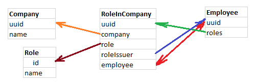

# Our domen     
http://mexdev.ru/  
uses Route53  
(now EC2 on AWS is offline)  
# Confluence   
https://mexdev-ru.atlassian.net/wiki/spaces/MONTANA/pages/4653139  
# Jira Kanban  
https://mexdev-ru.atlassian.net/jira/software/c/projects/MON/boards/1  
# Front     
another repo in git, build with docker-compose up 
# TODO      
https://mexdev-ru.atlassian.net/wiki/spaces/MONTANA/pages/9011201/2021-08-17+upd+08-31  

# Swagger link (file downloader)
- http://localhost:8082/swagger-ui/index.html?configUrl=/api/api-docs/swagger-config
# Service 1 (User)
## Entity
- User
    - uuid
    - first_name
    - last_name
    - patronymic
    - email
    - phone

----
## Request Table
Path: /user

|   | GET | PUT | POST | DELETE |
|:----|:----------:|----------:|:----------:|:----------:|
| For one user | /id | /id |  | /id |
| For all users | /all | :x: | :x: | :x: |

----
## Requests features

Standard requests for interacting with the database

----
# Service 2 (Employee)
## Entities
- Company
    - uuid
    - name

- Role
    - id
    - name

- Employee
    - uuid
    - roles (list)

- RoleInCompany
    - uuid
    - company
    - role
    - role_issuer
    - employee
    
----
## Table relationships

----
## Requests Tables
### Company
Path: /company

|   | GET | PUT | POST | DELETE |
|:----|:----------:|----------:|:----------:|:----------:|
| For one user | /id | /id |  | /id |
| For all users | /all | :x: | :x: | :x: |
### Role
Path: /role

|   | GET | PUT | POST | DELETE |
|:----|:----------:|----------:|:----------:|:----------:|
| For one user | /id | /id |  | /id |
| For all users | /all | :x: | :x: | :x: |
### Employee
Path: /employee

|   | GET | PUT | POST | DELETE |
|:----|:----------:|----------:|:----------:|:----------:|
| For one user | /id | /id & /add_role/id |  | /id |
| For all users | /all | :x: | :x: | :x: |
### RoleInCompany
|   | GET | PUT | POST | DELETE |
|:----|:----------:|----------:|:----------:|:----------:|
| For one user | :x: | :x: | :x: | :x: |
| For all users | :x: | :x: | :x: | :x: |
____
## Requests features

### Company

- POST
    - a company with this name should not exist
    - when creating a company, an employee and the ADMIN role are also created, if there is no one

- Standard requests for interacting with the database

### Role

- POST
    - a role with this name should not exist
  
- Standard requests for interacting with the database

### Employee

- POST
    - it is created only with a zero list of roles

- PUT (/add_role)
    - the company must exist
    - the role must exist  
    - the role issuer must have some role in the specified company

### RoleInCompany

None
____    
# How to start service with database in Docker
- Open terminal and go to the project directory
- mvn clean install -DskipTests=true (mvnw for Win)
- docker-compose up -d 
- __docker-compose down__ any time you want to turn off Docker(before change docker-compose.yml)   

---
# Keycloak
Гайд, по которому создавать ream и пользователей (my_realm, my_client, Роли: ADMIN, USER)
_https://habr.com/ru/company/reksoft/blog/552346/_

	
